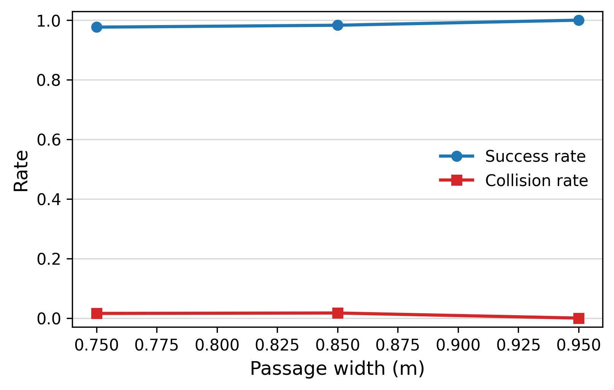
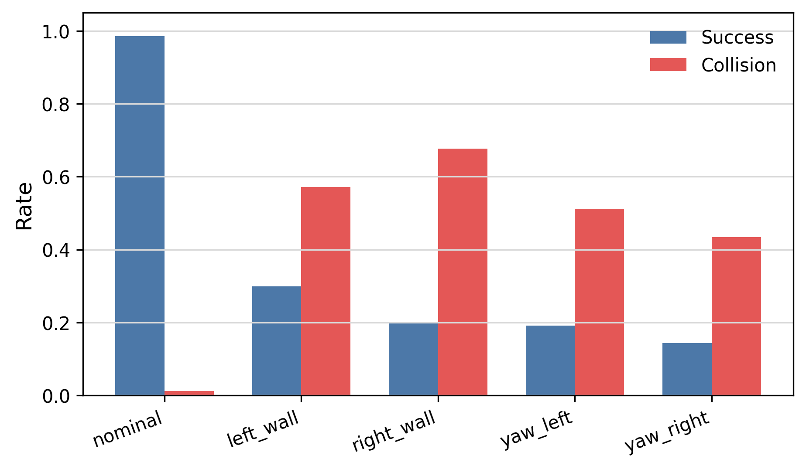
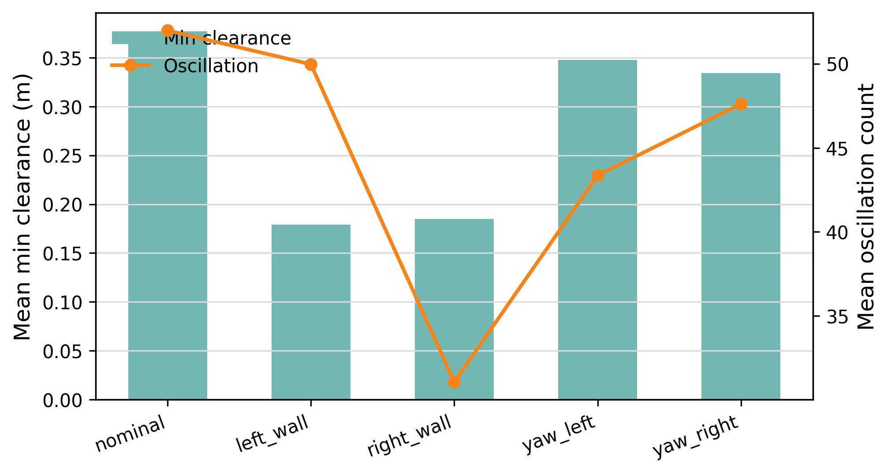

# Results

This repository evaluates Isaac Sim / Isaac Lab experiments for narrow-passage
low-level quadruped locomotion RL. The policy is a PPO-trained ANYmal-C
controller that outputs low-level joint position targets for local traversal
through narrow corridors. The repository does not train a high-level memory
module, does not implement a full navigation decision policy, and does not claim
to solve global navigation.

## Nominal Narrow-Passage Traversal

The main nominal traversal result uses the memory-free low-level locomotion
checkpoint evaluated on straight corridors of different widths. Metrics are
reported as trial rates unless otherwise stated.

| Method | SR@75 | SR@85 | SR@95 | collision | wedge | reject |
| --- | ---: | ---: | ---: | ---: | ---: | ---: |
| PPO low-level gait | 1.000 | 0.984 | 1.000 | 0.005 | 0.000 | 0.000 |

Source: `logs/narrow_passage_eval/stage1_width_scan_summary.json`.

## Recovery-Start / Failure-Start Evaluation

Recovery-start evaluation initializes the same low-level policy from perturbed
states inside the corridor. These states are fixed-start diagnostics rather than
memory-based recovery policies.

| Scenario | Success | Collision | Mean min clearance | Mean oscillation |
| --- | ---: | ---: | ---: | ---: |
| left_wall | 0.438 | 0.484 | 0.180 | 33.39 |
| right_wall | 0.000 | 1.000 | 0.187 | 7.44 |
| yaw_left | 0.188 | 0.812 | 0.348 | 10.34 |
| yaw_right | 0.156 | 0.500 | 0.330 | 45.00 |

Source: `logs/narrow_passage_eval/stage2c_small_yaw_contact_safe_eval_summary.json`.

## Figures

The following figures are generated from `logs/narrow_passage_eval/` with:

```bash
python scripts/plot_narrow_results.py \
  --input_dir logs/narrow_passage_eval \
  --output_dir figures
```







## Ablation Table

The repository now defines a common ablation protocol for low-level
narrow-passage locomotion. All completed runs should be exported with the shared
CSV schema:

```text
method, scenario, width, trial, success, collision, wedge, rejected, oscillation_count, completion_time, min_clearance
```

Planned ablation methods:

| Method | Task / interface | Reward or curriculum change |
| --- | --- | --- |
| full_reward_policy | `Isaac-Narrow-Gait-Ablation-FullReward-Anymal-C-v0` | Full reward, recovery-start curriculum |
| no_clearance_reward | `Isaac-Narrow-Gait-Ablation-NoClearanceReward-Anymal-C-v0` | `unsafe_clearance.weight = 0.0` |
| no_centerline_reward | `Isaac-Narrow-Gait-Ablation-NoCenterlineReward-Anymal-C-v0` | `centerline_penalty.weight = 0.0` |
| no_recovery_curriculum | `Isaac-Narrow-Gait-Ablation-NoRecoveryCurriculum-Anymal-C-v0` | Entrance-only reset, no recovery-start reset |
| scripted_velocity_controller | `scripts/narrow_passage/evaluate_scripted_velocity_controller.py` | Hand-written velocity baseline interface; no learned policy |

Current ablation result table. Rows marked `TBD` require running the
corresponding policy checkpoint and exporting standardized CSV rows before they
should be reported as quantitative results.

| Method | SR@75 | SR@85 | SR@95 | collision | wedge | reject |
| --- | ---: | ---: | ---: | ---: | ---: | ---: |
| full_reward_policy | TBD | TBD | TBD | TBD | TBD | TBD |
| no_clearance_reward | TBD | TBD | TBD | TBD | TBD | TBD |
| no_centerline_reward | TBD | TBD | TBD | TBD | TBD | TBD |
| no_recovery_curriculum | TBD | TBD | TBD | TBD | TBD | TBD |
| scripted_velocity_controller | TBD | TBD | TBD | TBD | TBD | TBD |

## Interpretation

The nominal narrow-passage results show that a PPO low-level locomotion policy
can stably traverse narrow straight corridors in Isaac Sim when initialized from
the corridor entrance. The policy remains memory-free and uses only
proprioceptive state, low-level command information, and compact local geometry.

The recovery-start results are substantially harder. Near-wall and yawed
initial states produce high collision rates, especially for right-wall and
yaw-left starts. This indicates that low-level motion control alone is not yet a
complete recovery solution under severe in-corridor perturbations.

These failures motivate a higher-level failure-aware decision layer or memory
module outside the scope of this repository. Such a module could decide when to
reject entry, reroute, pause, back out, or trigger a dedicated recovery behavior,
while this repository focuses on the low-level locomotion controller and its
Isaac Sim validation.
